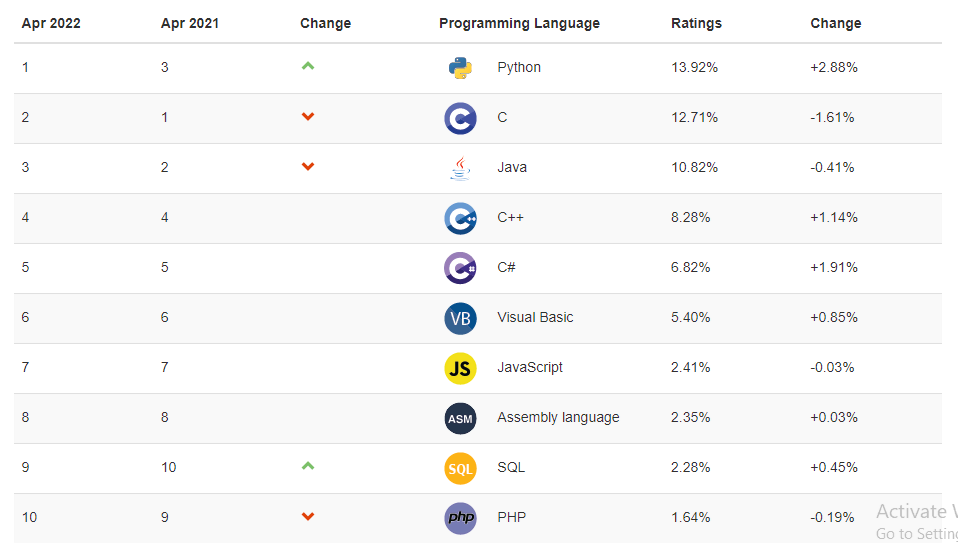

# Kelas Python

<div align="center">
    
</div>

[Python](https://python.org) adalah basaha pemrograman serbaguna yang bisa dijalankan pada semua arsitektur sistem dan bisa digunakan diberbagai bidang, mulai dari `Web Development`, `Artificial Intelligent`, `Machine Learning`, hingga `Software Development`

Python dikenal dengan kesederhanaannya, karena bahasa pemrograman ini cocok buat pemula. Bisa kita lihat perbedaannya dengan bahasa pemrograman yang lain. Kita lihat perbedaan program hello world dengan menggunakan bahasa `C` dengan `Python`

```c
// Program C
#include <stdio.h>

int main() {
    printf("Hello World");

    return 0;
}
```

Sedangkan Python hanya perlu satu baris saja untuk membuat program hello world.

```python
print("Hello World")
```

---

## Apa sih kegunaan python

Python bisa digunakan di berbagai bidang-bidang yang terkait ilmu komputer/sistem informasi seperti:

1. [Web Development](https://en.wikipedia.org/wiki/Web_development)
2. [GUI (Graphical User Interface)](https://en.wikipedia.org/wiki/Graphical_user_interface)
3. [Scientific and Numeric](https://pandas.pydata.org/)
4. [Software Development]()
5. [System Administration]()
6. [AI (Articial Intelligent)](https://tensorflow.org)

---

## Kelebihan Python

- Python tersedia secara gratis.
- Mudah dipelajari.
- Peluang kerja yang luas dengan gaji yang tinggi.
- Python populer di komunitas pemrograman.
- Serbaguna.

---

## Perusahaan Besar yang menggunakan Python

1. [Google](https://google.com)
2. [Facebook](https://facebook.com)
3. [Instagram](https://instagram.com)
4. [Dropbox](https://dropbox)
5. [Spotify](https://spotify.com)
6. [Uber](https://www.uber.com)
7. [Lyft](https://www.lyft.com)
8. [Netflix](https://www.netflix.com)
9. Dan masih banyak lainnya.

---

## Python Populer di Komunitas Pemrograman

Berdasarkan TIOBE Programming Community Index yang mengindikasikan popularitas bahasa pemrograman, Python menempati posisi nomor satu hingga April 2022.



---

### Python itu jenis bahasa pemrograman apa sih

Python adalah bahasa pemrograman interpreted, object-oriented, dan tingkat tinggi. Artinya, Python menggunakan software yang disebut interpreter untuk membaca kode baris demi baris saat program Python dieksekusi, bukan membaca keseluruhannya sekaligus.

---

[Syllabus Of Python](SYLLABUS.md)
